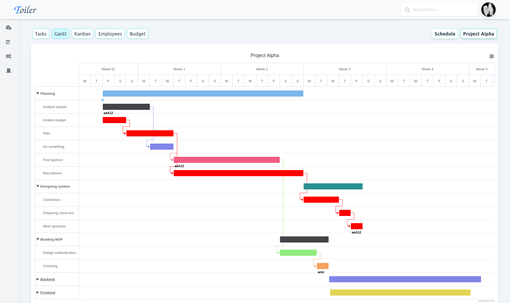

# Toiler 

### A gantt chart project for scheduling

Start your scheduling with a Free web app. Let Toiler amaze you with its cool features and get your project to a whole new level. 

- It's based on [Svelte](https://svelte.dev) and [Tailwind CSS](https://tailwindcss.com/)
- It uses [Highcharts](https://www.highcharts.com) for rendering svg-based gantt chart
- It can show activities by heritage or Kanban-like view
- Provides drag and drop in Gantt view
- Exporting data as PNG, Excel, PDF

### Building Frontend

1. Install NodeJS **LTS** version from <a href="https://nodejs.org/en/">NodeJs Official Page</a>
1. Download the product on this page
1. Unzip the downloaded file to a folder in your computer
1. Open Terminal
1. Go to your file project (where you’ve unzipped the product)
1. (If you are on a linux based terminal) Simply run `npm run install:clean`
1. (If not) Run in terminal `npm install`
1. (If not) Run in terminal `npm run build:tailwind` (each time you add a new class, a class that does not exist in `src/assets/styles/tailwind.css`, you will need to run this command)
1. (If not) Run in terminal `npm run build:fontawesome`
1. (If not) Run in terminal `npm run dev`
1. Navigate to https://localhost:5000

